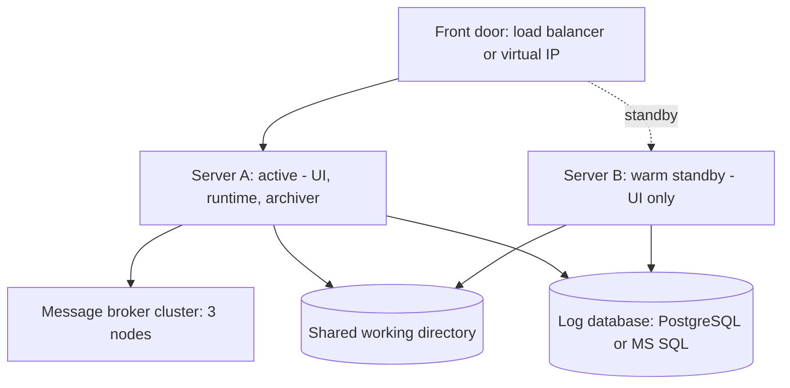

# HA Deployment

An HA deployment is a production environment run as an **active / warm-standby pair**: two Linkiir servers sharing one working directory and one log database, with a front door sending clients to whichever is active. If the active server fails, the standby promotes itself in about half a minute and no messages are lost.

## How it differs from a single-server PROD environment

| | [PROD](prod.md) | HA |
| --- | --- | --- |
| Linkiir servers | 1 | 2, one active at a time |
| Working directory | Local | Shared, one directory both servers open |
| Log database | PostgreSQL or MS SQL | PostgreSQL or MS SQL, reachable from both |
| Broker | External cluster | External cluster, three nodes |
| Server failure | A maintenance event | A failover of seconds |
| License | Enterprise | Enterprise with the HA feature |

Everything else is the same: the same release, the same projects, the same import and export path between environments.

## Full documentation

The [High Availability](../../high-availability/index.md) section covers it in depth:

| Page | Covers |
| --- | --- |
| [High Availability](../../high-availability/index.md) | What HA protects against, and what it does not |
| [Terminology](../../high-availability/terminology.md) | Active, standby, failover, failback, quorum, RPO and RTO |
| [Licensing](../../high-availability/licensing.md) | One Enterprise license with the HA feature per pair |
| [Architecture](../../high-availability/architecture.md) | The design, key components, and the failover sequence |
| [System Requirements](../../high-availability/system-requirements.md) | Sizing, shared storage, database, broker, ports |
| [Topologies](../../high-availability/topologies.md) | The five supported deployment shapes |
| [Using the HA Settings](../../high-availability/ha-settings.md) | The High Availability page: enable HA, name the servers, step down |
| [Operating an HA Pair](../../high-availability/operations.md) | Testing a failover, patching without downtime, monitoring |
| [Backup and DR](../../high-availability/backup-and-disaster-recovery.md) | Why HA is not a backup, and how DR differs |
| [Planning Your Deployment](../../high-availability/planning-your-deployment.md) | What to decide and prepare before the build |

:::caution HA is not a backup
Both servers read one copy of your data, so a deletion or a bad change affects both at once. An HA deployment still needs instance backups, a remote per project, and database backups. See [Backup and Restore](../backup-restore/index.md).
:::
