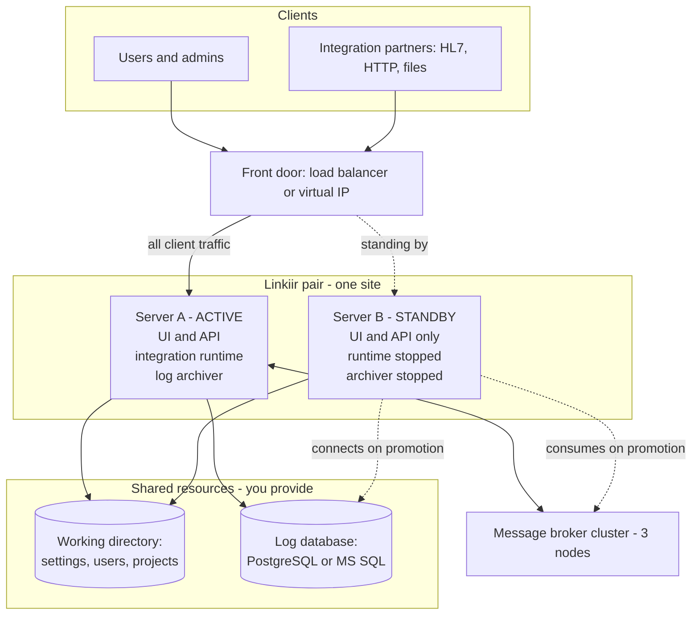
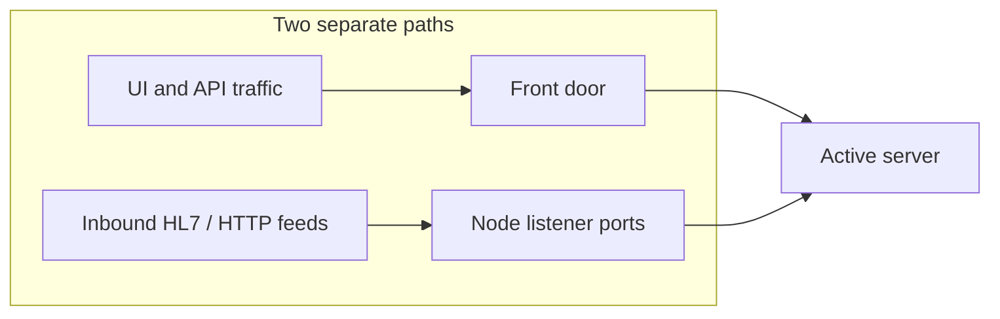

# HA Architecture

Linkiir HA is an **active / warm-standby pair** coordinating through one shared working directory. This page covers the design at the level you need to evaluate it, size it, and reason about its failure behavior.

## The design

Both servers are installed identically and are interchangeable. The only difference between them at any moment is which one currently holds the active role.

## Key components

| Component | What it does | Runs on |
| --- | --- | --- |
| **Linkiir UI and API** | The administrative surface: projects, workflows, settings, monitoring | Both servers, always |
| **Integration runtime** | Executes your workflows and node scripts | The active server only |
| **Log archiver** | Writes message history and log records to the log database | The active server only |
| **Shared working directory** | Holds settings, users, roles, and projects, so both servers work from one set | Shared storage you provide |
| **Log database** | Holds message history and searchable log records | PostgreSQL or MS SQL you provide |
| **Message broker cluster** | Carries messages between workflow steps, and holds them during a failover | Three nodes, yours or managed |
| **Front door** | Sends client traffic to whichever server is active | Load balancer or virtual IP you provide |

The standby keeps its UI and API running, which is why you can always sign in to it to see its status — but it runs no workflows and writes no log records, so nothing is processed twice.

## How the role moves

The role is **decided, not configured**. One server holds it; the other monitors and takes over if it stops being held. You do not nominate a primary, and no decision from you is needed at the moment of failure.

Three consequences worth understanding before you design around it:

- **Nothing extra to install.** There is no third server, witness process, or cluster manager in the design, and therefore none to fail or to patch.
- **Shared storage is the dependency that matters.** The pair depends on it being available and responsive, so its latency and its own redundancy are first-class requirements rather than details. See [System Requirements](system-requirements.md#shared-storage).
- **The timings are adjustable, and the defaults suit most sites.** They give roughly 18 seconds to detect an unplanned failure and about 30 seconds to full recovery. You can see and change them on the High Availability page — see [Failover timings](ha-settings.md#failover-timings).

## What happens during a failover

| Stage | Elapsed |
| --- | --- |
| The active server fails | 0 s |
| The standby detects it | ~15 s |
| The standby promotes itself, starting the runtime and the archiver | ~18 s |
| Your front door catches up and moves client traffic | +2–10 s |
| Workflows resume on the promoted server, processing from the broker | ~30 s |

What is preserved across it:

| | Outcome |
| --- | --- |
| Messages in flight | Wait in the broker, then processed by the promoted server. None lost |
| Duplicate processing | None. Archiving resumes from committed offsets, and a redelivered message is not stored twice |
| Signed-in users | Stay signed in. A session issued by one server is accepted by the other |
| Running workflows | Stop with the failed server, restart on the promoted one |
| The recovered server | Rejoins as **standby** and does not take the role back |

## Nothing to keep in step by hand

Settings, users, roles, projects, licensing, and the HA settings themselves are shared by the pair. You change them once, on either server, and both use them. There is no second copy to update and none to drift out of step — which is why adding a standby does not add administrative work.

The only things that legitimately differ between the two servers are the host they run on and the address each is reached at.

## Where integration traffic goes

This is the most commonly missed part of an HA rollout, so it is worth stating plainly.

Your load balancer covers the UI and API. Inbound integration feeds arrive on **node listener ports** on the active server, and if those must also follow a failover they need the same treatment — a virtual IP, or a load-balancer rule per listener port. Decide this explicitly during planning. See [Planning Your Deployment](planning-your-deployment.md).

## Design boundaries

| The design does not | Because |
| --- | --- |
| Run both servers at once to share load | Exactly one server is active. The standby is idle by design, so HA adds resilience rather than capacity |
| Scale beyond two servers | Only one can be active, so a third adds cost and no availability |
| Span two data centres as one pair | Two locations cannot form a majority for the broker cluster. See [Disaster Recovery](backup-and-disaster-recovery.md#disaster-recovery) |
| Replace your backups | Both servers read one copy of the data. See [Backup, Restore, and Disaster Recovery](backup-and-disaster-recovery.md) |

## Next

- [System Requirements](system-requirements.md)
- [HA Topologies](topologies.md)
- [Backup, Restore, and Disaster Recovery](backup-and-disaster-recovery.md)
