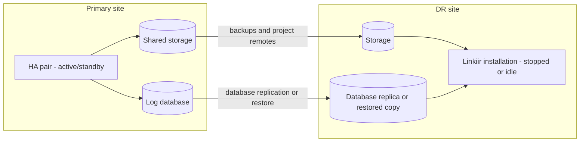

# Backup, Restore, and Disaster Recovery

Three different capabilities that solve three different problems. They are routinely confused, and the confusion is expensive — it is usually discovered during an incident that none of them covers.

## The three, compared

| | High Availability | Backup and restore | Disaster recovery |
| --- | --- | --- | --- |
| **Protects against** | A server or process failing | Damage to the data itself | Losing the whole site |
| **Scope** | One site, two servers | Point-in-time copies, held elsewhere | A second location |
| **Recovery time** | Seconds | Hours | Hours to days |
| **Data loss** | None | Back to the last good copy | Back to the last replicated copy |
| **Automatic** | Yes | The copies are; the restore is not | No — a declared decision |
| **What Linkiir provides** | The active/standby pair | Instance and project backups you configure | Support for building it; the sites are yours |

**HA gives you uptime. Backups give you recoverability. DR gives you a second place to run.** A production deployment needs all three, and each covers a category the others cannot.

## Why HA is not a backup

:::danger[The two servers share one copy of your data]
An HA pair has **one** working directory and **one** log database. That sharing is exactly what makes failover fast — and it means anything that damages the data damages it for both servers at the same instant. Delete a project on the active server and it is gone on the standby too, immediately.
:::

| Event | Does HA help? | What actually recovers it |
| --- | --- | --- |
| Active server dies | **Yes** — that is what HA is for | HA |
| Someone deletes a project | No | Project backup |
| A bad configuration change is saved | No | Instance backup |
| Database corruption | No | Database backup |
| Ransomware reaches the shared storage | No | Off-site, versioned backups |
| Shared storage array fails | No | Storage redundancy, then backups |
| The site is lost | No | Disaster recovery |

## What a complete Linkiir backup covers

Three separate things, and a backup is only complete when all three are configured. Configuring the first one alone is the most common gap.

| What | How it is protected | Cadence |
| --- | --- | --- |
| **Instance configuration** — settings, users, roles | Instance backup to a remote you provide | Automatic, hourly |
| **Projects and workflows** | Each project pushed to **its own** remote | On change |
| **Log database** — message history and log records | Your database platform's own backups | Per your retention policy |

:::caution[The instance backup does not include your integrations]
Projects are separate repositories with their own remotes. An instance backup protects settings, users, and roles — not your workflows. Configure both.
:::

See [Backup and Restore](../administration/backup-restore/index.md) for how each is set up, and make the backup destinations reachable from **both** servers so a failover does not interrupt them.

## Restoring, and what changes

A restore rebuilds an installation from those copies. Two consequences to plan for rather than discover:

**A restore onto replacement servers needs the license re-applied.** Put it in the runbook as an explicit step, and agree it with Linkiir support in advance rather than discovering it mid-incident. See [HA Licensing](licensing.md).

**Restoring a pair means restoring one shared working directory, not two copies.** Both servers must end up opening the same restored directory, at the same path. Restoring into two directories and pointing one server at each produces two separate installations rather than a pair.

Test a restore on a schedule. An untested backup is an assumption.

## Disaster recovery

DR is about a second location, and it is a different project from HA.

### Why an HA pair is not DR

Both servers in a pair sit in one site, share one storage system, and depend on one broker cluster. A site-level event takes all of it.

### Why a pair cannot be stretched across two sites

The broker cluster needs a **majority** of its nodes reachable to accept writes. Split three nodes across two sites and one site holds two nodes and the other holds one: losing the first site halts the cluster, while losing the second does not. The result survives one specific site failure and not the other, which is not a DR posture anyone should sign off.

Two approaches that do work:

| Approach | How it works | Trade-off |
| --- | --- | --- |
| **Witness site** | Two main sites plus a small third location holding one broker node, so a majority survives losing either main site | Needs a third location with reliable, low-latency connectivity to both |
| **Independent deployments with replication** | A separate Linkiir installation at the DR site, kept current from backups and replicated project remotes, brought up on a declared decision | Recovery is manual and slower, but each site stands alone |

For most organisations the second approach is the practical one, because it needs no third location and no low-latency link between sites.

### Planning a DR site

Settle these before you build it:

- **Your RPO and RTO for a site loss.** They are hours, not the seconds an HA failover gives you. Write them down, because they drive everything else.
- **How data reaches the DR site** — database replication, restored backups, replicated project remotes, or a combination.
- **How integration partners reach the DR site.** Feeds arrive on listener ports at a specific address. Moving them is usually the slowest part of a real DR event.
- **The licensing position for the DR installation.** Agree it with us in advance. See [HA Licensing](licensing.md).
- **Who declares a disaster, and what the runbook says.** DR is not automatic, and it should not be.
- **How you test it.** Untested DR is a plan, not a capability.

## Putting it together

| Layer | Covers | Recovery | Who builds it |
| --- | --- | --- | --- |
| HA pair | Server and process failure | Seconds, automatic | Linkiir with you |
| Instance and project backups | Data damage and mistakes | Hours, manual | You, in Linkiir |
| Database backups | Log and history loss | Hours, manual | Your database team |
| Storage redundancy | Shared-storage failure | Depends on the platform | Your infrastructure team |
| DR site | Site loss | Hours to days, declared | You, with Linkiir support |

## Next

- [Planning Your Deployment](planning-your-deployment.md)
- [Backup and Restore](../administration/backup-restore/index.md)
- [HA Licensing](licensing.md)
