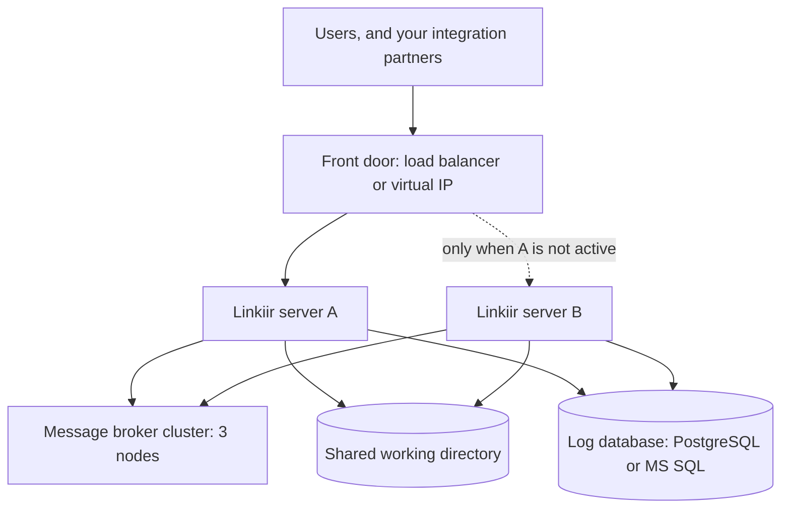

# High Availability

Linkiir High Availability runs **two Linkiir servers as an active / warm-standby pair**. One serves users and runs your integrations. The other stays up, idle, watching. If the active server fails, the standby takes over automatically in about half a minute, and no messages are lost.

These pages explain what HA is, what it costs you in infrastructure, and which shape of deployment fits your estate — so you can plan and budget before anyone installs anything.

These pages cover the concepts, the design, and how to use HA once you have it. [Using the HA Settings](ha-settings.md) and [Operating an HA Pair](operations.md) are the two you will come back to.

:::info The initial build is done with Linkiir support
Installing the pair and configuring your load balancer are done with Linkiir support, against your environment. Once it is built, everything you do with HA day to day is in the Linkiir UI and documented here.

When you have chosen a topology, email [support@linkiir.com](mailto:support@linkiir.com) with your platform, your chosen topology, and your message volumes.
:::

## Where to start

| You want to | Read |
| --- | --- |
| Learn the vocabulary before a design discussion | [HA Terminology](terminology.md) |
| Know what HA costs to license | [HA Licensing](licensing.md) |
| Understand how it works, and see the design | [HA Architecture](architecture.md) |
| Size the servers and storage | [System Requirements](system-requirements.md) |
| Choose the shape of your deployment | [HA Topologies](topologies.md) |
| Understand how HA relates to backups and DR | [Backup, Restore, and Disaster Recovery](backup-and-disaster-recovery.md) |
| Prepare for the build | [Planning Your Deployment](planning-your-deployment.md) |
| **Use the High Availability page** — enable HA, name the servers, step down | [Using the HA Settings](ha-settings.md) |
| **Run the pair** — test a failover, patch without downtime, monitor it | [Operating an HA Pair](operations.md) |

## What HA protects against

| Failure | Covered | How |
| --- | --- | --- |
| The Linkiir process crashes or hangs | Yes | The standby detects that the active server is no longer serving, and promotes itself |
| The active server dies — power, hardware, operating system | Yes | Same |
| Planned maintenance and patching | Yes | Move the role to the other server, patch the idle one, move it back |
| One message broker node lost | Yes | A three-node broker cluster keeps a majority and keeps serving |
| A database failover | Depends on your database | Linkiir reconnects. Your database platform's own HA does the work |

## What HA does not protect against

:::danger HA is not a backup
The two servers share **one** working directory and **one** log database. That sharing is what makes failover fast — and it means anything that damages the data damages it for both servers at the same instant.
:::

| Not covered | Why | What you need instead |
| --- | --- | --- |
| A deleted project, or a bad configuration change | Both servers read the same directory | [Backups](backup-and-disaster-recovery.md) |
| Database corruption | There is one database, shared | Database backups |
| Malicious or ransomware deletion | It reaches shared storage too | Off-site, versioned backups |
| Shared storage failure | It is the single resource both servers depend on | Storage-level redundancy, plus backups |
| Loss of the whole site | Both servers are in one site | [Disaster recovery](backup-and-disaster-recovery.md#disaster-recovery) — a second site |

**HA gives you uptime. Backups give you recoverability. A production deployment needs both.**

## What a failover looks like

| Event | Time before the pair is serving again |
| --- | --- |
| Unplanned failure — the server or process dies | About 18 seconds, plus a few seconds for your load balancer |
| Planned hand-over — you move the role deliberately | Under 10 seconds |
| Messages lost | None. In-flight messages wait in the broker and are processed by the promoted server |

Three behaviors that surprise people, all of them deliberate:

- **There is no primary to nominate.** The two servers are interchangeable. Whichever one currently holds the role is the active one, which is why a failover needs no decision from you.
- **Failback is manual.** A recovered server rejoins as standby and does not take the role back on its own. An automatic failback would be a second unplanned interruption.
- **Users stay signed in.** A session created on one server is accepted by the other, so nobody is logged out when the role moves.

## What a complete deployment contains

| Part | Who provides it |
| --- | --- |
| Two Linkiir servers | Linkiir release, installed twice |
| Three-node message broker cluster | You, or a managed offering |
| Front door that sends clients to the active server | You |
| Shared working directory | You |
| Log database with its own HA | You |

You supply the storage, the database, and the front door. Each is a mature product category with its own high-availability story, and Linkiir works with them rather than reimplementing them.

## Two numbers that are not negotiable

**Three broker nodes, never two.** The broker cluster needs a majority of its nodes reachable to accept writes. With two nodes the majority is two, so losing either one halts the cluster. A two-node cluster costs more than a single node and buys no availability. Use three, or five for very large deployments.

**Two Linkiir servers, not three.** Only one can be active at a time, so a third adds cost and no availability.

## Next

- [HA Terminology](terminology.md)
- [HA Architecture](architecture.md)
- [HA Topologies](topologies.md)
- [Using the HA Settings](ha-settings.md)
