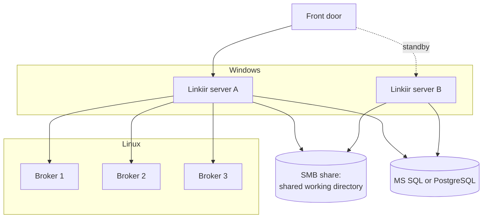
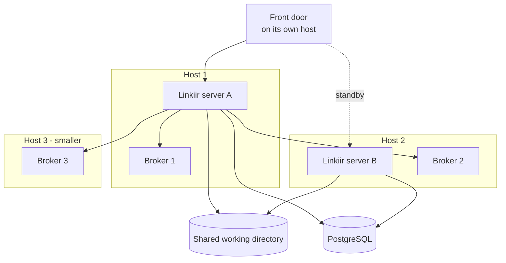
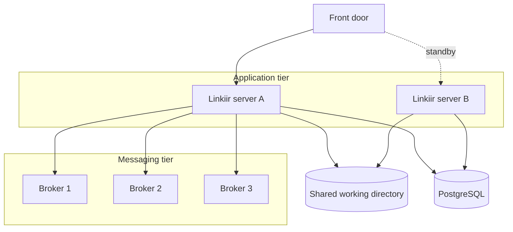
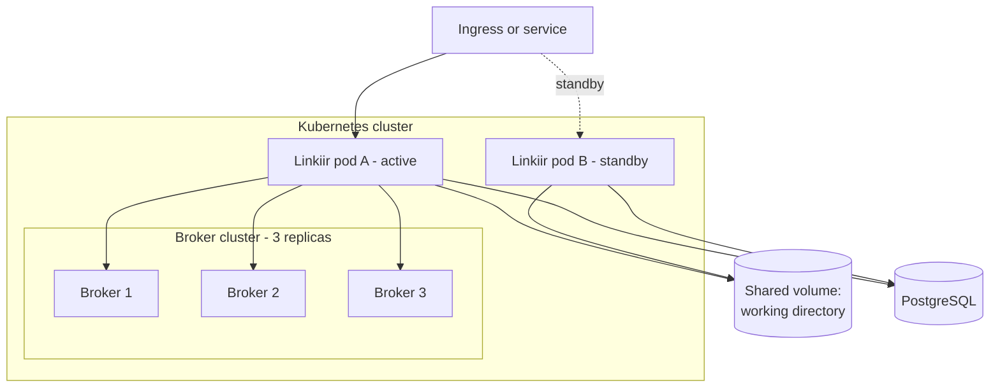
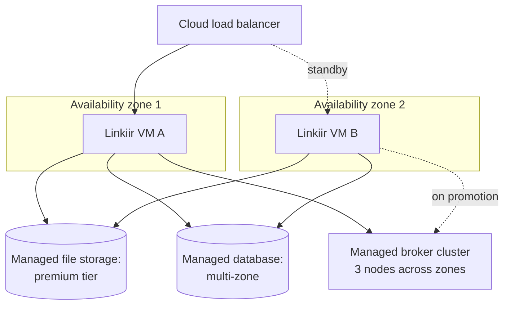

# HA Topologies

Five supported shapes for an HA deployment. They differ in **where the broker cluster lives** and **what platform runs it** — the Linkiir side of the build is the same in all five, so choosing between them is an infrastructure decision, not a Linkiir one.

## At a glance

| Topology | Servers | Layout | Choose when |
| --- | --- | --- | --- |
| **[A: Windows](#topology-a-windows)** | 5 | 2 Windows for Linkiir, 3 Linux for brokers | Your estate is Windows-standard |
| **[B: Linux co-located](#topology-b-linux-co-located)** | 3 | Brokers on all three, Linkiir on two of them | Linux, and the fewest servers |
| **[B+: Linux separated](#topology-b-linux-separated)** | 5 | 2 for Linkiir, 3 for brokers | Linux, with full role separation |
| **[C: Kubernetes](#topology-c-kubernetes)** | Varies | Linkiir and brokers as workloads in your cluster | Kubernetes is already your standard |
| **[D: Cloud](#topology-d-cloud)** | Varies | Linkiir across availability zones, managed broker and database | You are already on a public cloud |

Every topology needs the same four things around it: shared storage, a log database with its own HA, a front door, and time synchronisation. See [System Requirements](system-requirements.md).

---

## Topology A: Windows

Five servers. Linkiir on Windows, brokers on Linux.

| | |
| --- | --- |
| **Choose it when** | Windows is your standard platform for application servers |
| **Servers** | 2 Windows + 3 Linux |
| **Shared storage** | SMB share. The Linkiir service account needs full control on it |
| **Watch out for** | Brokers on Windows are supported but not recommended in production. Run Linkiir on Windows and the brokers on Linux, as drawn |

This is the most common shape in hospital estates, where Windows is standard for applications but a small Linux footprint for infrastructure services is acceptable.

---

## Topology B: Linux co-located

Three servers. The brokers run on all three; Linkiir runs on two of them.

| | |
| --- | --- |
| **Choose it when** | You run Linux and want the cheapest correct deployment |
| **Servers** | 3. The third runs brokers only, so it can be smaller |
| **Shared storage** | NFS or a clustered filesystem |
| **Watch out for** | Memory contention — a Linkiir server and a broker on one host compete. Size RAM for both |

:::caution Do not run the front door on either Linkiir host
Losing that host would take the load balancer with it, so a Linkiir failure and a front-door failure become the same event. Put it on a separate host, or use a load balancer you already run.
:::

This is the minimum correct HA deployment: three servers, plus the shared storage, database, and front door that most sites already have.

---

## Topology B+: Linux separated

Five servers. The same as B, with the brokers moved onto their own hosts.

| | |
| --- | --- |
| **Choose it when** | You run Linux and want each tier patched, sized, and owned separately |
| **Servers** | 2 + 3 |
| **Shared storage** | NFS or a clustered filesystem |
| **Watch out for** | Nothing specific. This is the most conventional shape, and the easiest to hand to separate infrastructure teams |

Prefer this over B when the messaging tier has a different owner, a different patch cycle, or a different growth curve from the application tier.

---

## Topology C: Kubernetes

Linkiir and the brokers as workloads in a cluster you already operate.

| | |
| --- | --- |
| **Choose it when** | Kubernetes is already your deployment standard and your team runs it well |
| **Servers** | However many nodes your cluster has. Linkiir is still fixed at two instances |
| **Shared storage** | A volume that supports simultaneous access from both pods, with file locking |
| **Watch out for** | Pod identity. Because hostnames are not stable in a cluster, each instance needs a pinned identity — support configures this during the build |

:::note Kubernetes adds no availability here
It is no simpler than three Linux servers and no more scalable, because Linkiir is two instances either way. Choose it because it fits how you already deploy and operate software, not in the expectation of better availability.
:::

---

## Topology D: Cloud

Linkiir on virtual machines spread across availability zones, with managed infrastructure services around it.

| | |
| --- | --- |
| **Choose it when** | You are already on a public cloud and want its managed services doing the heavy lifting |
| **Servers** | 2 VMs, plus managed broker and database services |
| **Shared storage** | Managed file storage, **premium tier**. Standard tiers are usually too slow for version-controlled project operations |
| **Watch out for** | Zone placement, storage tier, and whether the managed broker is a real cluster |

Three specifics worth settling early:

- **Spread the two virtual machines across availability zones.** Two VMs in one zone survive a host failure, not a zone failure.
- **Use a managed database with its own HA**, in a multi-zone configuration.
- **Confirm the managed broker offering with Linkiir support.** It must be a real broker cluster with replication and quorum, not only a protocol-compatible endpoint. Managed Kafka services from the major clouds and dedicated Kafka providers are both fine.

---

## Choosing

| If this is your constraint | Choose |
| --- | --- |
| Windows-standard estate | A |
| Fewest possible servers | B |
| Separate teams own application and messaging tiers | B+ |
| Everything already runs in Kubernetes | C |
| Cloud-first, prefer managed services | D |
| You need to survive losing a whole site | None of these on their own — see [Disaster Recovery](backup-and-disaster-recovery.md#disaster-recovery) |

Once you have chosen, [Planning Your Deployment](planning-your-deployment.md) lists what to have ready before the build.

## Next

- [Planning Your Deployment](planning-your-deployment.md)
- [System Requirements](system-requirements.md)
- [Backup, Restore, and Disaster Recovery](backup-and-disaster-recovery.md)
