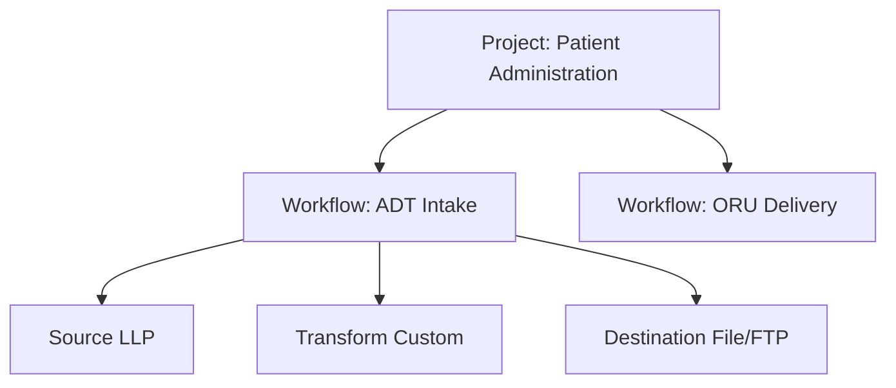

# How Interfaces Are Organized

This page explains the structure you work within when you build an interface, and what Linkiir handles on your behalf.

## Project, workflow, node



| Level | What it owns | What you do with it |
| --- | --- | --- |
| **Project** | Workflows, shared Lua modules, schemas, variables, credentials, libraries, and node templates | Group related interfaces; export and import as one unit |
| **Workflow** | The nodes and the connections between them | Start, stop, and version an interface |
| **Node** | One responsibility, its configuration, and its script | Configure a transport or write transformation logic |

Display names are separate from the internal identifiers Linkiir assigns, so you can rename a project, workflow, or node for clarity without breaking the interface or losing its history.

Some things are set once for the whole installation rather than per project — the HTTP server port and its TLS, the Grid port, session timeouts, users and roles, the Log Archive DB, and the license. See [Configurations](../administration/configurations/index.md) for which is which.

The workflow is also the unit your license counts: **Active Workflows** limits how many run at once. That makes how you divide interfaces between workflows a decision with a cost — see [Capacity and Expiry](../administration/licensing/capacity-and-expiry.md).

## A workflow is a chain you draw

```text
Source  →  Transform  →  Destination
```

You connect nodes in the workflow editor. That connection is the whole routing contract:

- A node's output goes to whatever you connected after it.
- Scripts never name a destination. `linkiir.flow.push` sends to the connected node, so re-wiring a workflow does not mean editing scripts.
- A node with nothing connected after it is a terminal node. It consumes, delivers, and produces no further message.

A node can fan out to more than one downstream node. Each connected node receives its own copy.

## Delivery between nodes is durable

Messages move between nodes through a message queue, not through direct calls. What that means in practice:

| Behaviour | What you can rely on |
| --- | --- |
| A stopped downstream node does not lose data | Messages wait in the queue and are delivered when it starts |
| A slow downstream node does not drop messages | The queue absorbs the backlog; you can watch queue depth |
| Order is preserved along a connection | Messages arrive at a downstream node in the order they were produced |
| Delivery is at-least-once | A message is delivered again rather than lost if processing is interrupted |

At-least-once has one consequence worth designing for: a message can be delivered twice after an interruption. Make downstream side effects idempotent where the target system allows it, so a redelivery does not create a duplicate clinical or financial transaction.

You do not create, name, or size queues. Linkiir provisions what a workflow needs when you deploy it, and removes nothing you still depend on.

## Concurrency

Most nodes process one message at a time, which keeps ordering predictable.

Source HTTP is the only exception: its **Worker Count** sets how many requests it handles simultaneously. Requests arrive, get handed to a free worker, and queue briefly if all workers are busy. Raise it when concurrent inbound requests matter; leave it at `1` when you want strictly sequential handling. No other node type has this field.

## Message history

Everything a workflow does is recorded for you: the payload at each step, node lifecycle events, script output, and errors. That history lives in the Log DB and is what the Grid's log search reads.

Two identifiers make it searchable:

| Identifier | Scope |
| --- | --- |
| **Message ID** | One message at one node |
| **Correlation ID** | The same across every node a message passes through |

Search a correlation ID to see one message's complete journey. Preserve it when you create a new message from an inbound one, rather than generating an unrelated ID — otherwise the trail breaks at that node.

:::note[History is written in the background]
Records reach the Log DB a moment after the event. Live node state updates immediately in the workflow view; searchable history catches up within seconds.
:::

## Where to work

| Environment | Use it for |
| --- | --- |
| DEV | Building, Run Test, Debug, synthetic data only |
| TEST | Realistic volumes, integration with test endpoints, parallel validation |
| PROD | Live traffic, change control, monitored |

Never point a DEV workflow at a production endpoint. See [Deployment](../administration/deployment/index.md).

## Next

- [Interfaces and Core Nodes](interfaces/index.md) — the node types and their fields.
- [Lua Programming](lua-programming/index.md) — writing node logic.
- [Error Handling and Retry](error-handling.md) — failure design.
